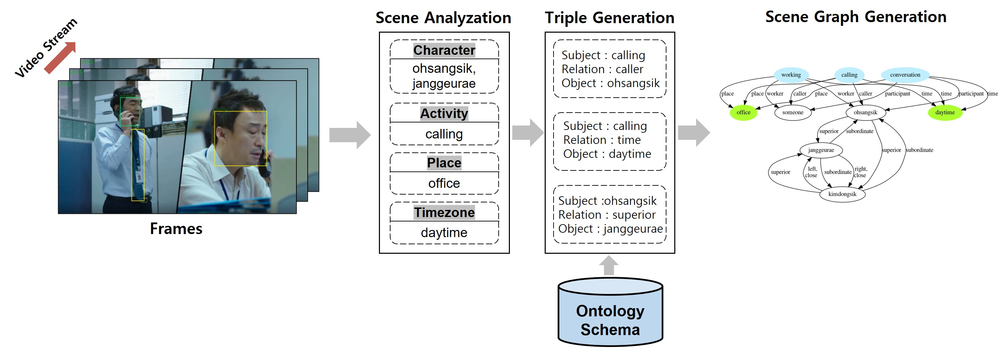
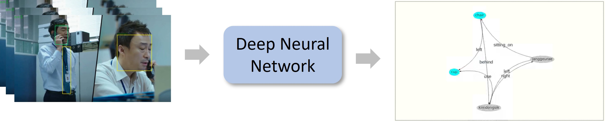
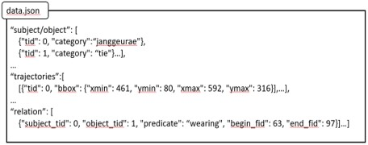

# MiseangProject
Scene Graph for Miseang(Drama)

- - -

## Project1 ✔
### Introdcution

* 심층 신경망 모델들로 부터 다양한 장면 구성 요소들 추출
* 사전에 정의해둔 온톨로지 스키마를 기반으로 장면 구성 요소들 사이의 관계를 정의하고 트리플 생성
* 생성된 트리플을 기반으로 장면 그래프 생성 

- -
### Video Demo
* Input Video

 

* Scene Graph

- - -

## Project2 ✔
### Introduction

* 관계를 온톨로지 스키마에 기반하여 정희하는 방식이 아닌 신경망으로 인식
* 이를 위해 새로운 스키마를 가지는 “Miseang-VidSG” 데이터 집합 생성

- -
### Dataset Structure

